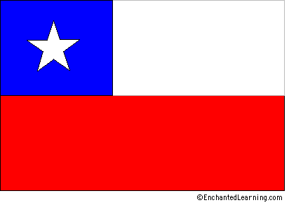

# Bandera de Chile

"

## Overview
El Bandera de Chile es roja, blanca y azul con una estrella de blanca. 

El cuadrado de azul en la zona superior izquierda representa cielo de azul; El zona de blanca en el derecho representa la nieve de los Antes; El zona roja en el debajo representa los sangre de las personas que murio por la independencia. La estrella unica representa un gobierno.

La bandera fue adoptado en el dieciocho de Octubre de mil ochocientos diecisiete.

